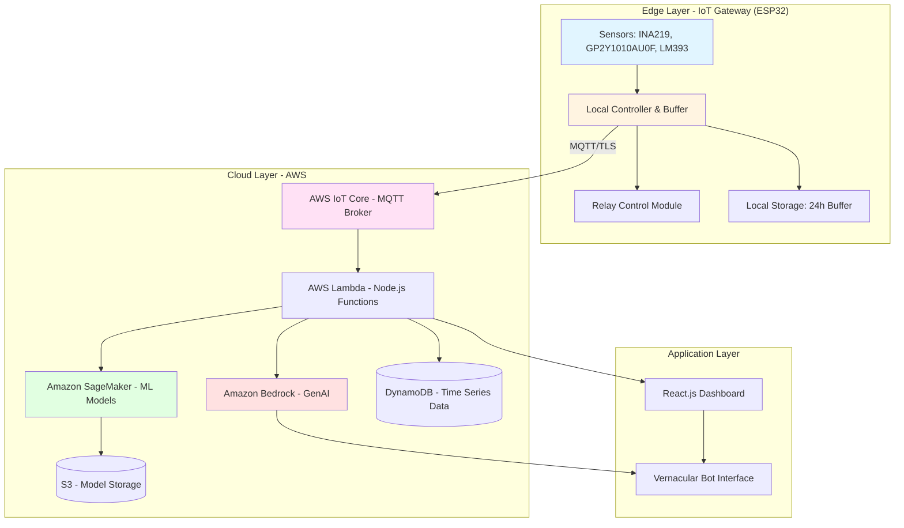
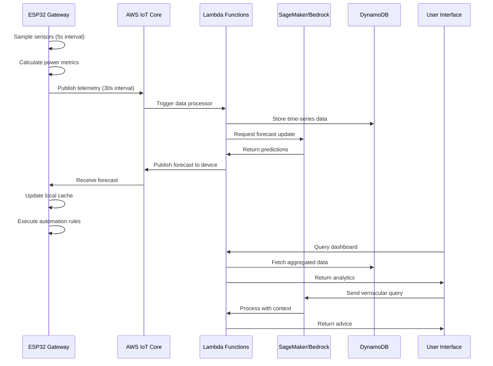

# Design Document: SouryaNova

## Overview

SouryaNova is an AI-powered solar energy management system architected as a distributed edge-cloud hybrid system. The design prioritizes offline-first operation, vernacular accessibility, and predictive intelligence to serve rural Indian communities with intermittent connectivity.

The system consists of three primary layers:

1. **Edge Layer**: ESP32-based IoT Gateway with local sensors, relay control, and data buffering
2. **Cloud Layer**: AWS-based backend providing AI inference, data storage, and API services
3. **Application Layer**: React-based web interface and GenAI-powered vernacular chatbot

The architecture emphasizes resilience through local autonomy, with the IoT Gateway capable of full monitoring and control operations during connectivity outages. Cloud services enhance capabilities through machine learning forecasts, natural language processing, and long-term analytics, but are not required for core functionality.

## Architecture

### System Architecture Diagram



### Data Flow Architecture



## Components and Interfaces

### 1. IoT Gateway (ESP32)

**Responsibilities:**
- Sensor data acquisition and processing
- Local relay control and automation
- Data buffering during offline periods
- MQTT communication with cloud
- Local forecast caching

**Key Interfaces:**

```typescript
interface SensorReading {
  timestamp: number;
  voltage: number;        // Volts
  current: number;        // Amperes
  power: number;          // Watts
  dustLevel: number;      // Dust sensor ADC value (0-1023)
  lightIntensity: number; // Light sensor ADC value (0-1023)
}

interface RelayCommand {
  relayId: number;        // Relay identifier (1-4)
  state: boolean;         // true = ON, false = OFF
  source: 'auto' | 'manual' | 'scheduled';
  timestamp: number;
}

interface LocalConfig {
  deviceId: string;
  wifiSSID: string;
  mqttBroker: string;
  sampleInterval: number;  // milliseconds
  publishInterval: number; // milliseconds
  appliances: ApplianceConfig[];
}

interface ApplianceConfig {
  relayId: number;
  name: string;
  powerRating: number;     // Watts
  priority: number;        // 1-10
  minSolarThreshold: number; // Watts
  enabled: boolean;
}
```

**Hardware Connections:**
- INA219: I2C bus for voltage/current monitoring
- GP2Y1010AU0F: Analog pin A0 for dust sensing
- LM393: Analog pin A1 for light intensity
- Relay Module: GPIO pins 25, 26, 27, 33 for 4-channel control

### 2. Cloud Backend (AWS Lambda + Node.js)

**Responsibilities:**
- MQTT message processing and routing
- Time-series data aggregation and storage
- ML model orchestration
- API endpoint provisioning
- Authentication and authorization

**Key Functions:**

```typescript
// Telemetry Processor
interface TelemetryMessage {
  deviceId: string;
  timestamp: number;
  readings: SensorReading;
  metadata: {
    firmwareVersion: string;
    signalStrength: number;
    batteryLevel?: number;
  };
}

async function processTelemetry(message: TelemetryMessage): Promise<void> {
  // Store in DynamoDB
  // Trigger forecast update if needed
  // Check for anomalies
  // Update device shadow
}

// Forecast Generator
interface ForecastRequest {
  deviceId: string;
  location: GeoLocation;
  panelSpecs: PanelSpecification;
  historicalData: SensorReading[];
}

interface ForecastResponse {
  deviceId: string;
  generatedAt: number;
  predictions: HourlyPrediction[];
  confidence: number;
  modelVersion: string;
}

interface HourlyPrediction {
  hour: number;           // 0-23
  expectedPower: number;  // Watts
  confidenceInterval: {
    lower: number;
    upper: number;
  };
}

async function generateForecast(request: ForecastRequest): Promise<ForecastResponse> {
  // Fetch weather data
  // Invoke SageMaker endpoint
  // Apply panel health adjustments
  // Return predictions
}

// Configuration Manager
interface DeviceConfig {
  deviceId: string;
  userId: string;
  location: GeoLocation;
  panelSpecs: PanelSpecification;
  appliances: ApplianceConfig[];
  preferences: UserPreferences;
  tokenBalance: number;
}

async function updateDeviceConfig(config: DeviceConfig): Promise<void> {
  // Validate configuration
  // Store in DynamoDB
  // Publish to device via IoT Core
}
```

### 3. Solar Yield Forecaster (SageMaker)

**Responsibilities:**
- 24-hour energy generation prediction
- Weather data integration
- Model training and retraining
- Confidence interval calculation

**Model Architecture:**
- Algorithm: Random Forest Regressor
- Features: hour, day_of_year, temperature, cloud_cover, humidity, historical_avg, panel_health_score, dust_index
- Target: hourly_power_output (Watts)
- Training: Weekly retraining with accumulated data

**Interfaces:**

```typescript
interface TrainingData {
  features: {
    hour: number;
    dayOfYear: number;
    temperature: number;      // Celsius
    cloudCover: number;       // Percentage 0-100
    humidity: number;         // Percentage 0-100
    historicalAvg: number;    // Watts
    panelHealthScore: number; // 0-100
    dustIndex: number;        // 0-100
  };
  target: number;             // Actual power output (Watts)
}

interface ModelInferenceRequest {
  deviceId: string;
  weatherForecast: WeatherData[];
  panelHealthScore: number;
  dustIndex: number;
  historicalPatterns: HistoricalPattern[];
}

interface WeatherData {
  timestamp: number;
  temperature: number;
  cloudCover: number;
  humidity: number;
  precipitation: number;
}
```

### 4. Vernacular Bot (Amazon Bedrock)

**Responsibilities:**
- Natural language understanding in Odia, Hindi, English
- Context-aware energy advice generation
- Query intent classification
- Response generation with cultural relevance

**Interfaces:**

```typescript
interface ChatMessage {
  sessionId: string;
  userId: string;
  deviceId: string;
  language: 'odia' | 'hindi' | 'english';
  inputType: 'text' | 'voice';
  message: string;
  timestamp: number;
}

interface ChatResponse {
  sessionId: string;
  response: string;
  language: 'odia' | 'hindi' | 'english';
  intent: QueryIntent;
  actionable: boolean;
  suggestedActions?: Action[];
  timestamp: number;
}

type QueryIntent = 
  | 'forecast_query'
  | 'cost_analysis'
  | 'maintenance_advice'
  | 'appliance_control'
  | 'system_status'
  | 'general_help';

interface Action {
  type: 'enable_appliance' | 'schedule_cleaning' | 'view_report';
  parameters: Record<string, any>;
  description: string;
}

interface BotContext {
  deviceId: string;
  currentGeneration: number;
  todayForecast: HourlyPrediction[];
  recentAlerts: Alert[];
  applianceStates: Record<number, boolean>;
  tokenBalance: number;
}

async function processVernacularQuery(
  message: ChatMessage,
  context: BotContext
): Promise<ChatResponse> {
  // Invoke Bedrock with system prompt
  // Include device context
  // Parse intent
  // Generate culturally appropriate response
  // Extract actionable items
}
```

### 5. Panel Health Monitor

**Responsibilities:**
- Individual panel performance tracking
- Degradation detection
- Anomaly identification
- Health score calculation

**Interfaces:**

```typescript
interface PanelHealthMetrics {
  panelId: string;
  deviceId: string;
  healthScore: number;        // 0-100
  degradationRate: number;    // Percentage per year
  dustAccumulationIndex: number; // 0-100
  expectedOutput: number;     // Watts at standard conditions
  actualOutput: number;       // Watts current average
  efficiency: number;         // Percentage
  lastCleaningDate: number;
  anomalies: Anomaly[];
}

interface Anomaly {
  type: 'sudden_drop' | 'gradual_decline' | 'intermittent' | 'physical_damage';
  severity: 'low' | 'medium' | 'high';
  detectedAt: number;
  description: string;
  estimatedImpact: number;    // Watts lost
}

function calculateHealthScore(
  expectedOutput: number,
  actualOutput: number,
  dustIndex: number,
  age: number
): number {
  // Base score from output ratio
  const outputRatio = actualOutput / expectedOutput;
  let score = outputRatio * 100;
  
  // Adjust for dust (recoverable)
  score = score - (dustIndex * 0.15);
  
  // Adjust for age (expected degradation ~0.5% per year)
  const expectedDegradation = age * 0.5;
  score = score + expectedDegradation;
  
  return Math.max(0, Math.min(100, score));
}
```

### 6. Load Manager

**Responsibilities:**
- Automated appliance scheduling
- Priority-based load allocation
- Manual override handling
- Relay state management

**Interfaces:**

```typescript
interface LoadDecision {
  timestamp: number;
  availableSolar: number;     // Watts
  forecastedSolar: number;    // Watts for next hour
  decisions: ApplianceDecision[];
}

interface ApplianceDecision {
  applianceId: number;
  action: 'activate' | 'deactivate' | 'maintain';
  reason: string;
  estimatedRuntime: number;   // minutes
  estimatedCost: number;      // rupees (negative = savings)
}

async function makeLoadDecisions(
  currentGeneration: number,
  forecast: HourlyPrediction[],
  appliances: ApplianceConfig[],
  currentStates: Record<number, boolean>
): Promise<LoadDecision> {
  // Sort appliances by priority
  // Calculate available power budget
  // Check forecast for sustained availability
  // Respect manual overrides
  // Generate activation decisions
}

interface ManualOverride {
  applianceId: number;
  state: boolean;
  overrideUntil: number;      // timestamp
  userId: string;
}
```

### 7. Maintenance Advisor

**Responsibilities:**
- Cost-benefit analysis for cleaning
- Optimal schedule calculation
- Weather-aware recommendations
- Financial impact estimation

**Interfaces:**

```typescript
interface MaintenanceRecommendation {
  deviceId: string;
  recommendationType: 'cleaning' | 'inspection' | 'repair';
  urgency: 'low' | 'medium' | 'high';
  estimatedCost: number;      // rupees
  estimatedSavings: number;   // rupees per month
  paybackPeriod: number;      // days
  scheduledDate?: number;
  reason: string;
  deferralReason?: string;
}

function calculateCleaningROI(
  currentDustIndex: number,
  energyLossRate: number,     // kWh per day
  electricityRate: number,    // rupees per kWh
  cleaningCost: number,       // rupees
  weatherForecast: WeatherData[]
): MaintenanceRecommendation {
  // Calculate daily loss in rupees
  const dailyLoss = energyLossRate * electricityRate;
  
  // Calculate payback period
  const paybackDays = cleaningCost / dailyLoss;
  
  // Check for rain in forecast
  const rainExpected = weatherForecast.some(w => w.precipitation > 5);
  
  // Generate recommendation
  if (dailyLoss > cleaningCost / 7 && !rainExpected) {
    return {
      recommendationType: 'cleaning',
      urgency: 'high',
      estimatedCost: cleaningCost,
      estimatedSavings: dailyLoss * 30,
      paybackPeriod: paybackDays,
      reason: `Dust causing ₹${dailyLoss.toFixed(2)}/day loss`
    };
  }
  // ... additional logic
}
```

## Data Models

### DynamoDB Tables

**1. DeviceRegistry Table**
```typescript
interface DeviceRegistryItem {
  PK: string;                 // "DEVICE#{deviceId}"
  SK: string;                 // "METADATA"
  deviceId: string;
  userId: string;
  location: {
    latitude: number;
    longitude: number;
    address: string;
    timezone: string;
  };
  panelSpecs: {
    capacity: number;         // kWp
    panelCount: number;
    manufacturer: string;
    installationDate: number;
    tiltAngle: number;
    azimuth: number;
  };
  status: 'active' | 'inactive' | 'maintenance';
  createdAt: number;
  updatedAt: number;
}
```

**2. TelemetryData Table**
```typescript
interface TelemetryDataItem {
  PK: string;                 // "DEVICE#{deviceId}"
  SK: string;                 // "TELEMETRY#{timestamp}"
  deviceId: string;
  timestamp: number;
  voltage: number;
  current: number;
  power: number;
  energy: number;             // Cumulative kWh
  dustLevel: number;
  lightIntensity: number;
  temperature?: number;
  ttl: number;                // Auto-delete after 90 days
}
```

**3. ForecastData Table**
```typescript
interface ForecastDataItem {
  PK: string;                 // "DEVICE#{deviceId}"
  SK: string;                 // "FORECAST#{generatedAt}"
  deviceId: string;
  generatedAt: number;
  validUntil: number;
  predictions: HourlyPrediction[];
  confidence: number;
  modelVersion: string;
  weatherSource: string;
  ttl: number;                // Auto-delete after 7 days
}
```

**4. UserAccounts Table**
```typescript
interface UserAccountItem {
  PK: string;                 // "USER#{userId}"
  SK: string;                 // "PROFILE"
  userId: string;
  email: string;
  phoneNumber: string;
  preferredLanguage: 'odia' | 'hindi' | 'english';
  subscriptionTier: 'free' | 'token' | 'enterprise';
  tokenBalance: number;
  devices: string[];          // Array of deviceIds
  electricityRate: number;    // rupees per kWh
  createdAt: number;
  updatedAt: number;
}
```

**5. MaintenanceLog Table**
```typescript
interface MaintenanceLogItem {
  PK: string;                 // "DEVICE#{deviceId}"
  SK: string;                 // "MAINT#{timestamp}"
  deviceId: string;
  timestamp: number;
  type: 'cleaning' | 'inspection' | 'repair' | 'upgrade';
  performedBy: string;
  cost: number;
  notes: string;
  beforeHealthScore: number;
  afterHealthScore: number;
}
```

### Local Storage (ESP32 SPIFFS)

```typescript
interface LocalBufferEntry {
  timestamp: number;
  readings: SensorReading;
  synced: boolean;
}

interface LocalCache {
  lastForecast: ForecastResponse;
  deviceConfig: LocalConfig;
  pendingCommands: RelayCommand[];
  bufferSize: number;
  lastSyncTime: number;
}
```


## Correctness Properties

A property is a characteristic or behavior that should hold true across all valid executions of a system—essentially, a formal statement about what the system should do. Properties serve as the bridge between human-readable specifications and machine-verifiable correctness guarantees.

### Property Reflection

After analyzing all acceptance criteria, several opportunities for consolidation emerged:

- Properties 1.1 and 1.6 can be combined: forecast generation should always include both 24 predictions and confidence intervals
- Properties 4.2 and 4.3 overlap: priority-based allocation inherently handles insufficient power scenarios
- Properties 5.4 and 5.5 form a round-trip: buffering and syncing are complementary operations
- Properties 6.1 and 6.2 can be unified: cumulative savings is the integral of daily savings
- Properties 9.1 and 9.5 both address encryption but at different layers (in-transit vs at-rest)

The following properties represent the minimal, non-redundant set that validates all testable requirements.

### Solar Yield Forecasting Properties

**Property 1: Complete forecast structure**
*For any* valid weather data and historical patterns, the Solar_Yield_Forecaster should produce exactly 24 hourly predictions, each containing an expected power value and confidence interval (lower and upper bounds).
**Validates: Requirements 1.1, 1.6**

**Property 2: Panel health impact on forecasts**
*For any* two identical forecast requests differing only in panel health score or dust index, the forecast with lower health/higher dust should predict lower power output.
**Validates: Requirements 1.2**

**Property 3: Forecast recalibration trigger**
*For any* forecast where actual generation data shows accuracy below 80%, the system should trigger a recalibration process using recent actual data.
**Validates: Requirements 1.3**

**Property 4: Weather data completeness**
*For any* weather forecast retrieved, it should contain cloud cover percentage, temperature, humidity, and precipitation values for each hour.
**Validates: Requirements 12.2**

**Property 5: Temperature effect on efficiency**
*For any* two forecasts with identical conditions except temperature, the forecast with higher temperature should predict lower power output (accounting for panel efficiency degradation with heat).
**Validates: Requirements 12.4**

**Property 6: Fallback to historical patterns**
*For any* forecast request when weather API is unavailable, the system should use historical seasonal patterns and still produce valid predictions.
**Validates: Requirements 12.3**

**Property 7: Monsoon season adjustment**
*For any* forecast during monsoon months (June-September), predicted values should be lower than non-monsoon months with similar cloud cover, accounting for increased humidity and diffuse light.
**Validates: Requirements 12.5**

**Property 8: Extreme weather alerts**
*For any* weather forecast containing extreme conditions (wind >50 km/h, hail, or temperature >50°C), the system should generate a protective alert.
**Validates: Requirements 12.7**

### Vernacular Interface Properties

**Property 9: Language consistency**
*For any* user query in a specific language (Odia, Hindi, or English), the response should be in the same language as the query.
**Validates: Requirements 2.1**

**Property 10: Actionable response content**
*For any* bot response, it should contain at least one specific recommendation or action item (not just data reporting).
**Validates: Requirements 2.2**

**Property 11: Contextual information inclusion**
*For any* bot response to energy-related queries, it should reference at least one of: current solar generation, forecast data, or appliance recommendations.
**Validates: Requirements 2.3**

**Property 12: Offline query queuing**
*For any* queries submitted during offline periods, they should be stored in a queue and processed in order when connectivity resumes.
**Validates: Requirements 2.5**

**Property 13: Session context preservation**
*For any* sequence of messages within a 10-minute session, follow-up questions should have access to context from previous messages in that session.
**Validates: Requirements 2.6**

### Maintenance and Health Monitoring Properties

**Property 14: Dust threshold alerting**
*For any* dust accumulation level causing energy loss exceeding 5%, the Maintenance_Advisor should generate a cleaning alert.
**Validates: Requirements 3.1**

**Property 15: Degradation threshold flagging**
*For any* panel with a health score below 85%, the system should flag it for inspection.
**Validates: Requirements 3.3**

**Property 16: Financial impact calculation**
*For any* dust accumulation level, the Maintenance_Advisor should calculate a non-negative rupee value representing daily energy loss.
**Validates: Requirements 3.4**

**Property 17: Cost-benefit cleaning optimization**
*For any* cleaning recommendation, the estimated savings over the payback period should exceed the cleaning cost (positive ROI).
**Validates: Requirements 3.5**

**Property 18: Weather-aware deferral**
*For any* non-urgent cleaning recommendation when rain is forecasted within 48 hours, the recommendation should be deferred.
**Validates: Requirements 3.6**

**Property 19: Anomaly detection**
*For any* panel performance data showing sudden drops (>20% in 1 day), gradual decline (>10% over 7 days), or intermittent patterns, the system should detect and flag an anomaly.
**Validates: Requirements 3.7**

### Load Management Properties

**Property 20: Threshold-based activation**
*For any* solar generation level exceeding an appliance's configured threshold, the Load_Manager should activate that appliance's relay (unless other constraints prevent it).
**Validates: Requirements 4.1**

**Property 21: Priority-based allocation**
*For any* situation where available solar power is insufficient for all queued appliances, only appliances with the highest priority values should be activated, up to the power budget.
**Validates: Requirements 4.2, 4.3**

**Property 22: Forecast-aware prevention**
*For any* appliance requiring sustained power, if the forecast shows insufficient generation for the expected runtime, activation should be prevented.
**Validates: Requirements 4.4**

**Property 23: Manual override respect**
*For any* appliance manually overridden by a user, the system should maintain that state for 2 hours before resuming automated control.
**Validates: Requirements 4.5**

**Property 24: Activation logging completeness**
*For any* relay activation or deactivation, a log entry should exist containing timestamp, relay ID, state, power level, and source (auto/manual/scheduled).
**Validates: Requirements 4.6**

**Property 25: Grid usage notification**
*For any* time period where grid power consumption exceeds solar generation, the system should generate a notification with optimization suggestions.
**Validates: Requirements 4.7**

### Energy Monitoring Properties

**Property 26: Power calculation correctness**
*For any* voltage and current readings, the calculated instantaneous power should equal voltage × current (within measurement tolerance).
**Validates: Requirements 5.2**

**Property 27: Buffer-sync round trip**
*For any* sensor data buffered during offline periods, when connectivity resumes, all buffered entries should be transmitted to the cloud and marked as synced.
**Validates: Requirements 5.4, 5.5**

**Property 28: Timestamp precision**
*For any* sensor data stored in the cloud, the timestamp should have millisecond precision (13-digit Unix timestamp).
**Validates: Requirements 5.6**

**Property 29: Malfunction alert generation**
*For any* sensor readings indicating malfunction (voltage <0, current <0, or power calculation mismatch >10%), a diagnostic alert should be generated.
**Validates: Requirements 5.7**

### Cost Analysis Properties

**Property 30: Savings calculation accuracy**
*For any* solar energy generated and electricity rate, daily savings should equal (solar_energy_kWh × rate_per_kWh).
**Validates: Requirements 6.1**

**Property 31: Cumulative savings integrity**
*For any* time period, cumulative savings should equal the sum of all daily savings within that period.
**Validates: Requirements 6.2**

**Property 32: Loss-adjusted reporting**
*For any* cost report, the reported savings should be less than or equal to theoretical maximum savings (accounting for dust and degradation losses).
**Validates: Requirements 6.3**

**Property 33: Maintenance savings projection**
*For any* maintenance recommendation, the system should estimate potential additional savings if the recommendation is followed.
**Validates: Requirements 6.4**

**Property 34: Actual vs projected comparison**
*For any* reporting period, the system should calculate the difference between actual savings and projected savings from system specifications.
**Validates: Requirements 6.5**

**Property 35: Monthly report completeness**
*For any* monthly report, it should contain sections for generation patterns, savings calculations, and optimization opportunities.
**Validates: Requirements 6.6**

**Property 36: High grid dependency recommendations**
*For any* period where Grid_Dependency exceeds 40%, the system should provide specific recommendations to increase solar utilization.
**Validates: Requirements 6.7**

### Offline-First Architecture Properties

**Property 37: Local forecast caching**
*For any* forecast received from the cloud, the IoT_Gateway should store a local copy that persists across connectivity losses.
**Validates: Requirements 7.2**

**Property 38: Offline decision-making**
*For any* load management decision made during offline operation, the system should use the most recent cached forecast data.
**Validates: Requirements 7.3**

**Property 39: Configuration persistence**
*For any* user preferences or automation rules, they should survive power cycles and be available immediately on restart (stored in non-volatile memory).
**Validates: Requirements 7.4**

**Property 40: Offline response availability**
*For any* common query (top 20 most frequent), the Vernacular_Bot should have a cached response available for offline operation.
**Validates: Requirements 7.6**

### Configuration and Validation Properties

**Property 41: Threshold configuration**
*For any* appliance, users should be able to set a minimum solar generation threshold, and that threshold should be enforced by the Load_Manager.
**Validates: Requirements 8.2**

**Property 42: Configuration validation**
*For any* automation rule modification, if the configuration is invalid (e.g., threshold exceeds system capacity, conflicting schedules), it should be rejected with a descriptive error.
**Validates: Requirements 8.3**

### Security Properties

**Property 43: Encryption in transit**
*For any* data transmission between IoT_Gateway and Cloud_Backend, the connection should use TLS 1.3 or higher.
**Validates: Requirements 9.1**

**Property 44: Certificate-based authentication**
*For any* IoT_Gateway connection attempt without a valid device certificate, the connection should be rejected.
**Validates: Requirements 9.2**

**Property 45: Role-based access control**
*For any* user attempting to access device data or perform management operations, access should be granted only if the user has the appropriate role permissions.
**Validates: Requirements 9.3**

**Property 46: Authentication requirement**
*For any* request to control appliances or modify configurations, the request should be rejected if the user is not authenticated.
**Validates: Requirements 9.4**

**Property 47: Encryption at rest**
*For any* personally identifiable information (email, phone number, address) stored in the database, it should be in encrypted form.
**Validates: Requirements 9.5**

**Property 48: Security event logging**
*For any* security-relevant event (authentication attempt, configuration change, access denial), a log entry should be created with timestamp, user ID, and event details.
**Validates: Requirements 9.6**

**Property 49: Suspicious activity response**
*For any* detected suspicious activity (multiple failed auth attempts, unusual access patterns), the system should temporarily disable remote control and send an alert to the user.
**Validates: Requirements 9.7**

### Scalability Properties

**Property 50: Multi-device aggregation**
*For any* user account with multiple devices, portfolio-level metrics (total generation, total savings) should equal the sum of individual device metrics.
**Validates: Requirements 10.2**

**Property 51: Comparative performance metrics**
*For any* set of devices under the same user account, the system should provide normalized performance metrics (kWh per kWp) enabling fair comparison.
**Validates: Requirements 10.3**

### Token Management Properties

**Property 52: Free tier eligibility**
*For any* installation with capacity less than 5 kWp, basic monitoring features should be available without token consumption.
**Validates: Requirements 11.1**

**Property 53: Token requirement for premium features**
*For any* installation exceeding 5 kWp capacity, AI forecasting and automation features should require available tokens.
**Validates: Requirements 11.2**

**Property 54: Token consumption calculation**
*For any* day of active optimization service, the system should deduct tokens equal to (capacity_kWp × 1).
**Validates: Requirements 11.3**

**Property 55: Low balance notification**
*For any* user account, when token balance will be depleted within 3 days at current consumption rate, a notification should be sent.
**Validates: Requirements 11.4**

**Property 56: Graceful feature degradation**
*For any* account with zero token balance, premium features (forecasting, automation) should be disabled while basic monitoring continues to function.
**Validates: Requirements 11.5**

**Property 57: Token value analytics**
*For any* token consumed, the system should calculate and report the value delivered (rupees saved or additional energy generated).
**Validates: Requirements 11.7**

## Error Handling

### Error Categories

**1. Hardware Errors**
- Sensor malfunction (out-of-range readings)
- Communication failures (I2C, MQTT)
- Relay control failures
- Power supply issues

**2. Network Errors**
- MQTT connection loss
- TLS handshake failures
- DNS resolution failures
- Timeout errors

**3. Cloud Service Errors**
- Lambda function failures
- SageMaker endpoint unavailability
- Bedrock API rate limiting
- DynamoDB throttling

**4. Data Errors**
- Invalid sensor readings
- Corrupted buffered data
- Missing required fields
- Schema validation failures

**5. Business Logic Errors**
- Invalid configuration
- Insufficient tokens
- Authorization failures
- Constraint violations

### Error Handling Strategies

**Retry with Exponential Backoff**
```typescript
async function retryWithBackoff<T>(
  operation: () => Promise<T>,
  maxRetries: number = 3,
  baseDelay: number = 1000
): Promise<T> {
  for (let attempt = 0; attempt < maxRetries; attempt++) {
    try {
      return await operation();
    } catch (error) {
      if (attempt === maxRetries - 1) throw error;
      const delay = baseDelay * Math.pow(2, attempt);
      await sleep(delay);
    }
  }
  throw new Error('Max retries exceeded');
}
```

**Circuit Breaker Pattern**
```typescript
class CircuitBreaker {
  private failureCount: number = 0;
  private lastFailureTime: number = 0;
  private state: 'closed' | 'open' | 'half-open' = 'closed';
  
  async execute<T>(operation: () => Promise<T>): Promise<T> {
    if (this.state === 'open') {
      if (Date.now() - this.lastFailureTime > 60000) {
        this.state = 'half-open';
      } else {
        throw new Error('Circuit breaker is open');
      }
    }
    
    try {
      const result = await operation();
      this.onSuccess();
      return result;
    } catch (error) {
      this.onFailure();
      throw error;
    }
  }
  
  private onSuccess(): void {
    this.failureCount = 0;
    this.state = 'closed';
  }
  
  private onFailure(): void {
    this.failureCount++;
    this.lastFailureTime = Date.now();
    if (this.failureCount >= 5) {
      this.state = 'open';
    }
  }
}
```

**Graceful Degradation**
```typescript
async function getForecastWithFallback(
  deviceId: string
): Promise<ForecastResponse> {
  try {
    // Try cloud-based ML forecast
    return await getSageMakerForecast(deviceId);
  } catch (error) {
    console.warn('SageMaker unavailable, using fallback');
    try {
      // Fallback to simple historical average
      return await getHistoricalAverageForecast(deviceId);
    } catch (fallbackError) {
      // Last resort: use cached forecast
      return await getCachedForecast(deviceId);
    }
  }
}
```

**Dead Letter Queue for Failed Messages**
```typescript
interface FailedMessage {
  originalMessage: any;
  error: string;
  timestamp: number;
  retryCount: number;
}

async function processWithDLQ(message: TelemetryMessage): Promise<void> {
  try {
    await processTelemetry(message);
  } catch (error) {
    await sendToDeadLetterQueue({
      originalMessage: message,
      error: error.message,
      timestamp: Date.now(),
      retryCount: 0
    });
  }
}
```

### Error Response Formats

**API Error Response**
```typescript
interface ErrorResponse {
  error: {
    code: string;           // Machine-readable error code
    message: string;        // Human-readable message
    details?: any;          // Additional context
    timestamp: number;
    requestId: string;
  };
}

// Example error codes
const ErrorCodes = {
  SENSOR_MALFUNCTION: 'ERR_SENSOR_001',
  NETWORK_TIMEOUT: 'ERR_NETWORK_001',
  INSUFFICIENT_TOKENS: 'ERR_TOKEN_001',
  INVALID_CONFIG: 'ERR_CONFIG_001',
  AUTH_FAILED: 'ERR_AUTH_001',
  RATE_LIMIT_EXCEEDED: 'ERR_RATE_001'
};
```

**IoT Gateway Error Handling**
```cpp
// ESP32 error handling
enum ErrorSeverity {
  INFO,
  WARNING,
  ERROR,
  CRITICAL
};

struct ErrorLog {
  ErrorSeverity severity;
  const char* component;
  const char* message;
  unsigned long timestamp;
};

void handleError(ErrorSeverity severity, const char* component, const char* message) {
  // Log locally
  logError(severity, component, message);
  
  // For critical errors, enter safe mode
  if (severity == CRITICAL) {
    enterSafeMode();
  }
  
  // Try to report to cloud if connected
  if (mqttClient.connected()) {
    publishErrorReport(severity, component, message);
  }
}

void enterSafeMode() {
  // Disable all relay automation
  disableAllRelays();
  
  // Continue sensor monitoring only
  // Flash LED to indicate safe mode
  // Wait for manual intervention or recovery
}
```

## Testing Strategy

### Dual Testing Approach

The SouryaNova system requires both unit testing and property-based testing for comprehensive validation:

**Unit Tests** focus on:
- Specific examples demonstrating correct behavior
- Edge cases (empty inputs, boundary values, extreme conditions)
- Error conditions and exception handling
- Integration points between components
- Mock-based testing of external dependencies

**Property-Based Tests** focus on:
- Universal properties that hold for all inputs
- Comprehensive input coverage through randomization
- Invariant validation across transformations
- Round-trip properties (serialization, parsing)
- Metamorphic relationships between operations

Both approaches are complementary and necessary. Unit tests catch concrete bugs and validate specific scenarios, while property tests verify general correctness across the input space.

### Property-Based Testing Configuration

**Framework Selection:**
- **JavaScript/TypeScript**: fast-check
- **Python**: Hypothesis
- **Embedded C++ (ESP32)**: Manual property test implementation with random generators

**Test Configuration:**
- Minimum 100 iterations per property test (due to randomization)
- Seed-based reproducibility for failed tests
- Shrinking enabled to find minimal failing examples
- Timeout: 30 seconds per property test

**Property Test Tagging:**
Each property-based test must include a comment referencing the design document property:

```typescript
// Feature: sourya-nova, Property 1: Complete forecast structure
test('forecast should contain 24 hourly predictions with confidence intervals', () => {
  fc.assert(
    fc.property(
      fc.record({
        weatherData: weatherDataArbitrary(),
        historicalPatterns: historicalPatternsArbitrary()
      }),
      (input) => {
        const forecast = generateForecast(input.weatherData, input.historicalPatterns);
        
        expect(forecast.predictions).toHaveLength(24);
        forecast.predictions.forEach(pred => {
          expect(pred).toHaveProperty('expectedPower');
          expect(pred).toHaveProperty('confidenceInterval');
          expect(pred.confidenceInterval).toHaveProperty('lower');
          expect(pred.confidenceInterval).toHaveProperty('upper');
          expect(pred.confidenceInterval.lower).toBeLessThanOrEqual(pred.expectedPower);
          expect(pred.expectedPower).toBeLessThanOrEqual(pred.confidenceInterval.upper);
        });
      }
    ),
    { numRuns: 100 }
  );
});
```

### Test Data Generators

**Custom Arbitraries for Domain Objects:**

```typescript
// Weather data generator
function weatherDataArbitrary(): fc.Arbitrary<WeatherData> {
  return fc.record({
    timestamp: fc.integer({ min: Date.now(), max: Date.now() + 86400000 }),
    temperature: fc.float({ min: 15, max: 45 }),  // Celsius, realistic for India
    cloudCover: fc.float({ min: 0, max: 100 }),
    humidity: fc.float({ min: 20, max: 100 }),
    precipitation: fc.float({ min: 0, max: 50 })
  });
}

// Sensor reading generator
function sensorReadingArbitrary(): fc.Arbitrary<SensorReading> {
  return fc.record({
    timestamp: fc.integer({ min: 0, max: Date.now() }),
    voltage: fc.float({ min: 0, max: 60 }),      // Typical solar system voltage
    current: fc.float({ min: 0, max: 20 }),      // Typical current
    dustLevel: fc.integer({ min: 0, max: 1023 }),
    lightIntensity: fc.integer({ min: 0, max: 1023 })
  }).map(reading => ({
    ...reading,
    power: reading.voltage * reading.current
  }));
}

// Appliance configuration generator
function applianceConfigArbitrary(): fc.Arbitrary<ApplianceConfig> {
  return fc.record({
    relayId: fc.integer({ min: 1, max: 4 }),
    name: fc.constantFrom('Water Pump', 'Washing Machine', 'Refrigerator', 'Fan'),
    powerRating: fc.integer({ min: 50, max: 2000 }),
    priority: fc.integer({ min: 1, max: 10 }),
    minSolarThreshold: fc.integer({ min: 100, max: 1500 }),
    enabled: fc.boolean()
  });
}
```

### Unit Test Examples

**Example 1: Power Calculation**
```typescript
describe('IoT Gateway Power Calculation', () => {
  test('should calculate power as voltage times current', () => {
    const voltage = 48.5;
    const current = 5.2;
    const expectedPower = 252.2;
    
    const power = calculatePower(voltage, current);
    
    expect(power).toBeCloseTo(expectedPower, 1);
  });
  
  test('should handle zero current', () => {
    const power = calculatePower(48.5, 0);
    expect(power).toBe(0);
  });
  
  test('should handle zero voltage', () => {
    const power = calculatePower(0, 5.2);
    expect(power).toBe(0);
  });
});
```

**Example 2: Token Deduction**
```typescript
describe('Token Management', () => {
  test('should deduct correct tokens for 3 kWp system', () => {
    const initialBalance = 100;
    const capacity = 3; // kWp
    const days = 1;
    
    const newBalance = deductTokens(initialBalance, capacity, days);
    
    expect(newBalance).toBe(97); // 100 - (3 * 1)
  });
  
  test('should not allow negative balance', () => {
    const initialBalance = 2;
    const capacity = 5;
    const days = 1;
    
    expect(() => deductTokens(initialBalance, capacity, days))
      .toThrow('Insufficient token balance');
  });
});
```

### Integration Testing

**MQTT Integration Test:**
```typescript
describe('MQTT Communication', () => {
  let mqttBroker: TestMQTTBroker;
  let gateway: IoTGateway;
  
  beforeEach(async () => {
    mqttBroker = await startTestBroker();
    gateway = new IoTGateway(mqttBroker.url);
  });
  
  test('should publish telemetry and receive forecast', async () => {
    const telemetry: TelemetryMessage = {
      deviceId: 'test-device-001',
      timestamp: Date.now(),
      readings: {
        voltage: 48.0,
        current: 5.0,
        power: 240.0,
        dustLevel: 150,
        lightIntensity: 800
      }
    };
    
    await gateway.publishTelemetry(telemetry);
    
    const forecast = await gateway.waitForForecast(5000);
    
    expect(forecast).toBeDefined();
    expect(forecast.predictions).toHaveLength(24);
  });
});
```

### End-to-End Testing

**Scenario: Complete Energy Optimization Flow**
```typescript
describe('E2E: Energy Optimization', () => {
  test('should optimize appliance usage based on forecast', async () => {
    // Setup
    const device = await provisionTestDevice({
      capacity: 3,
      appliances: [
        { name: 'Water Pump', powerRating: 750, priority: 10 },
        { name: 'Washing Machine', powerRating: 500, priority: 5 }
      ]
    });
    
    // Simulate sunny day forecast
    await injectForecast(device.id, {
      predictions: Array(24).fill(null).map((_, hour) => ({
        hour,
        expectedPower: hour >= 10 && hour <= 15 ? 2500 : 500,
        confidenceInterval: { lower: 2000, upper: 3000 }
      }))
    });
    
    // Simulate real-time generation
    await simulateGeneration(device.id, 2600); // Peak generation
    
    // Wait for automation
    await sleep(2000);
    
    // Verify both appliances activated during peak
    const relayStates = await getRelayStates(device.id);
    expect(relayStates[1]).toBe(true); // Water pump
    expect(relayStates[2]).toBe(true); // Washing machine
    
    // Simulate generation drop
    await simulateGeneration(device.id, 600);
    await sleep(2000);
    
    // Verify only high-priority appliance remains
    const newStates = await getRelayStates(device.id);
    expect(newStates[1]).toBe(true);  // Water pump still on
    expect(newStates[2]).toBe(false); // Washing machine off
  });
});
```

### Performance Testing

**Load Test Configuration:**
- Simulate 1,000 concurrent devices
- Each device publishes telemetry every 30 seconds
- Measure Lambda cold start times
- Measure DynamoDB read/write latency
- Measure SageMaker inference latency
- Target: p95 latency < 2 seconds for all operations

**Stress Test Scenarios:**
- Token depletion for 100 users simultaneously
- Network partition recovery with 24 hours of buffered data
- Forecast generation for 1,000 devices in parallel
- Vernacular bot handling 500 concurrent conversations

### Test Coverage Goals

- Unit test coverage: >80% for business logic
- Property test coverage: 100% of correctness properties
- Integration test coverage: All external service interactions
- E2E test coverage: All critical user journeys
- Edge case coverage: All error handling paths

